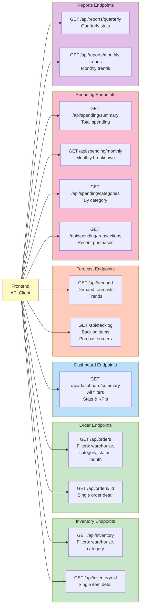

# API Endpoints Architecture

## Endpoint Summary

| Category | Endpoint | Method | Filters | Purpose |
|----------|----------|--------|---------|---------|
| **Inventory** | `/api/inventory` | GET | warehouse, category | List all inventory items |
| | `/api/inventory/:id` | GET | - | Get single inventory item |
| **Orders** | `/api/orders` | GET | warehouse, category, status, month | List all orders |
| | `/api/orders/:id` | GET | - | Get single order |
| **Dashboard** | `/api/dashboard/summary` | GET | All filters | Get KPIs and summary stats |
| **Forecast** | `/api/demand` | GET | - | Get demand forecasts |
| | `/api/backlog` | GET | - | Get backlog items with PO status |
| **Spending** | `/api/spending/summary` | GET | - | Total spending overview |
| | `/api/spending/monthly` | GET | - | Monthly spending breakdown |
| | `/api/spending/categories` | GET | - | Spending by category |
| | `/api/spending/transactions` | GET | - | Recent transactions |
| **Reports** | `/api/reports/quarterly` | GET | - | Quarterly performance stats |
| | `/api/reports/monthly-trends` | GET | - | Month-over-month trends |
