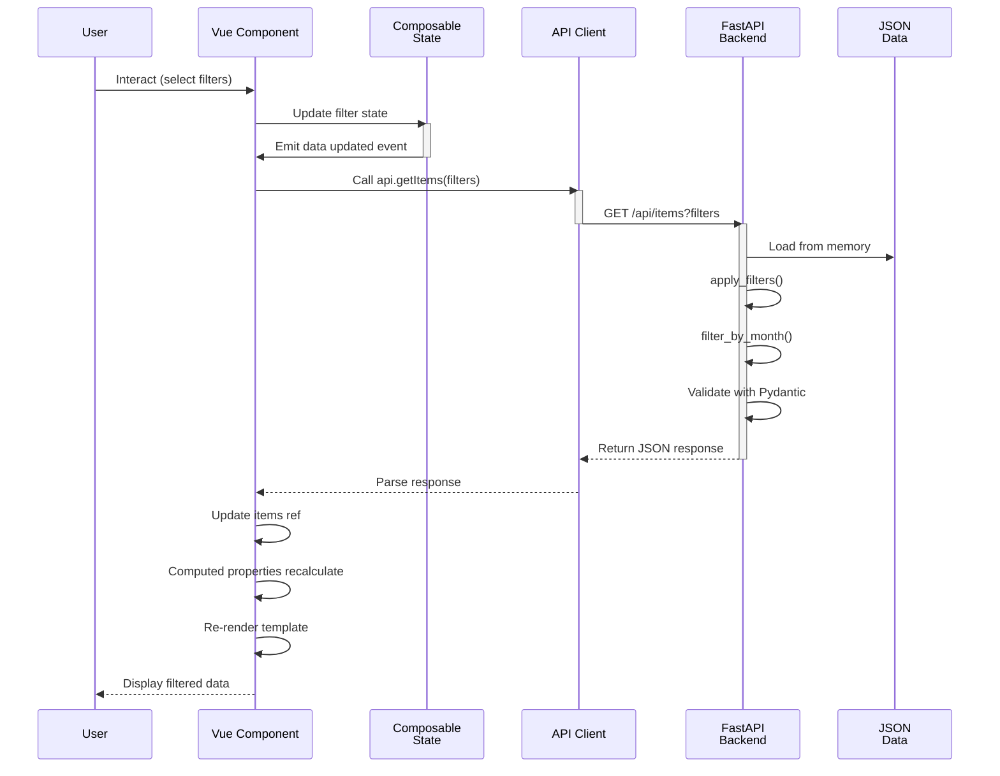

# Data Flow Diagram

## Data Flow Steps

1. **User Input**: Select filters in FilterBar component
2. **State Update**: Composable state updates (category, warehouse, status, month)
3. **API Call**: Frontend calls api.js with current filter values
4. **Network Request**: HTTP GET request sent to FastAPI backend
5. **Backend Processing**: 
   - Load in-memory data
   - Apply filters sequentially
   - Validate with Pydantic models
6. **Response**: JSON response returned to frontend
7. **State Update**: Component updates reactive refs with new data
8. **Recomputation**: Computed properties recalculate derived data
9. **Render**: Vue re-renders template with updated data
10. **Display**: User sees filtered results
